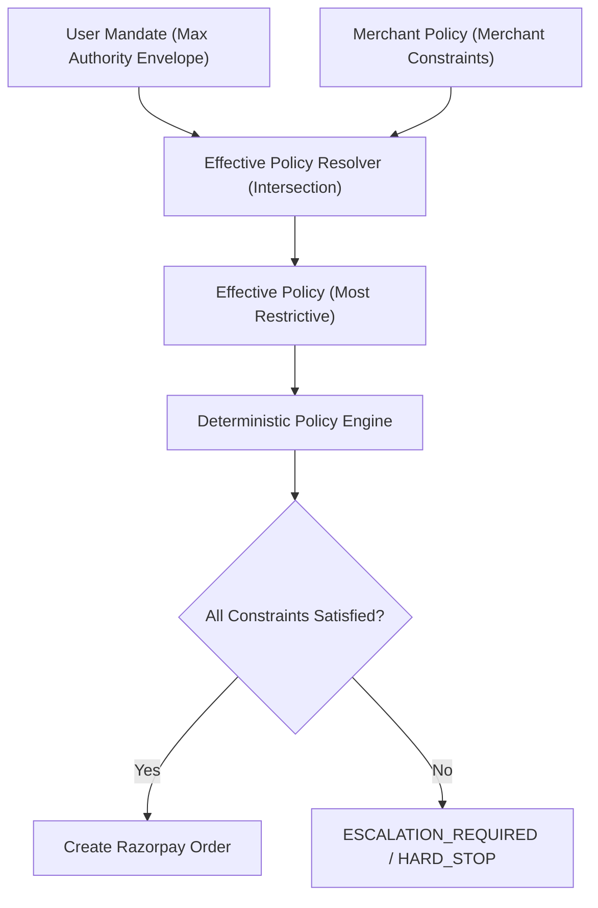

# Phase C3 — Merchant Recovery Control Plane Report

**Project**: Resilient-Agent-Relay  
**Hackathon**: Razorpay AI Buildathon 2026  
**Stage**: Phase C3 — Merchant Policy Layer, Authority Precedence & Bounded Execution  
**Date**: 2026-08-31  
**Status**: ✅ FULL PASS (GREEN)  

---

## 1. Executive Summary

Phase C3 introduces the **Merchant Recovery Control Plane**, enabling merchants to define fine-grained boundaries (margin thresholds, allowed categories, budget caps, attempt limits, and auto-recovery switches) without ever expanding the authority granted by the user mandate.

### Key Architectural Invariants:
- **Authority Precedence**: The effective authorization policy is strictly the **intersection / most restrictive combination** of `UserMandate` $\cap$ `MerchantRecoveryPolicy`.
- **Zero Expansion**: A merchant policy can **never** authorize a brand, price, category, or attribute that the user mandate disallows.
- **Deterministic Outcomes**: Explicit triage into `AUTONOMOUS_RECOVERY`, `ESCALATION_REQUIRED`, or `HARD_STOP`.
- **Bounded Execution**: Bounded retry limits (`max_recovery_attempts`) prevent infinite loops.
- **Full Policy Auditability**: Policy ID and version are immutably recorded on every transaction and recovery audit event.

---

## 2. Merchant Policy Schema

```typescript
export interface MerchantRecoveryPolicy {
  readonly policy_id: string;                          // Unique policy identifier (e.g. 'pol_merchant_v1')
  readonly policy_version: number;                     // Monotonically increasing version number
  readonly created_at: string;                         // ISO timestamp
  readonly max_substitution_price_delta_percent?: number; // Merchant tolerance cap (e.g. 8%)
  readonly max_recovery_amount_inr?: number;             // Merchant transaction cap (e.g. ₹5,300)
  readonly allowed_brands?: readonly string[];          // Whitelisted merchant brands
  readonly allowed_categories?: readonly string[];      // Whitelisted merchant categories
  readonly max_recovery_attempts?: number;               // Bounded retry limit (default: 2)
  readonly minimum_margin_percent?: number;              // Merchant profitability floor (e.g. 15%)
  readonly auto_recovery_enabled: boolean;               // Master killswitch for autonomous recovery
  readonly escalation_on_llm_timeout: boolean;           // Triage rule for AI timeouts
}
```

---

## 3. Authority Precedence & Effective Policy Resolution



### Mathematical Formulation:
$$\text{Budget}_{\text{effective}} = \min(\text{Budget}_{\text{user}}, \text{Budget}_{\text{merchant}})$$
$$\Delta\%_{\text{effective}} = \min(\Delta\%_{\text{user}}, \Delta\%_{\text{merchant}})$$
$$\text{Brands}_{\text{effective}} = \text{Brands}_{\text{user}} \cap \text{Brands}_{\text{merchant}}$$
$$\text{Categories}_{\text{effective}} = \text{Categories}_{\text{user}} \cap \text{Categories}_{\text{merchant}}$$

---

## 4. Recovery Decision Model

| Decision Type | Trigger Condition | System Action | Financial Consequence |
|:---|:---|:---|:---|
| **`AUTONOMOUS_RECOVERY`** | All hard mandate and merchant policy constraints pass; live stock and price revalidated. | Creates NEW Razorpay Test Mode Order; supersedes original transaction; launches checkout. | Authorized transaction executed at authoritative catalog price. |
| **`ESCALATION_REQUIRED`** | Policy block (price, brand, category, margin); retry limit exceeded; or LLM timeout with `escalation_on_llm_timeout = true`. | Halts automated execution; preserves failed state; notifies merchant/user for manual approval. | **Zero orders created; zero payments captured.** |
| **`HARD_STOP`** | Merchant has disabled `auto_recovery_enabled = false`, or candidate fails concurrent live stock revalidation. | Immediately terminates recovery workflow; marks transaction `RECOVERY_EXHAUSTED`. | **Zero orders created; zero payments captured.** |

---

## 5. Bounded Retries & Timeout Safety

### A. Bounded Retry Budget:
- Every recovery request tracks its attempt counter (`recovery_attempt`).
- If `recovery_attempt > max_recovery_attempts` (default: 2), execution immediately halts with `MAX_ATTEMPTS_EXCEEDED` $\rightarrow$ `ESCALATION_REQUIRED`.
- Prevents infinite recursion during volatile inventory oscillations.

### B. Bounded LLM Timeout:
- Remote LLM evaluations are strictly bounded by `RECOVERY_TIMEOUT_MS` (default: 8,000 ms) via `AbortSignal.timeout()`.
- On timeout, the system triggers safe escalation (`RECOVERY_TIMEOUT` $\rightarrow$ `ESCALATION_REQUIRED`), creating **0 orders** and recording the event in the audit trail.

---

## 6. Policy Versioning & Audit Trail

Every recovery event immutably logs:
1. `user_mandate`: Exact user constraints at checkout initiation.
2. `merchant_policy_id`: Identifier of the active merchant policy.
3. `merchant_policy_version`: Version number of the active merchant policy.
4. `effective_constraints`: The resolved intersection of limits.
5. `llm_recommendation`: The structured substitute candidate and confidence (excluding private chain-of-thought).
6. `policy_result`: Deterministic validation outcome and failure reasons.
7. `revalidation_result`: Real-time inventory and authoritative pricing checks.

---

## 7. Automated Test Suite Matrix

```text
✓ tests/gate-a.test.ts (21 tests)
✓ tests/gate-b1.test.ts (12 tests)
✓ tests/gate-b2.test.ts (24 tests)
✓ tests/gate-b3.test.ts (10 tests)
✓ tests/c2-timeout-safety.test.ts (2 tests)
✓ tests/c3-merchant-policy.test.ts (12 tests)

Test Files: 6 passed (6)
Tests:      81 passed (81)
Execution:  1.76 seconds
```

### C3 Test Suite Verification (`tests/c3-merchant-policy.test.ts`):
- `C3-1`: User allows + merchant allows $\rightarrow$ **PASS** (`AUTONOMOUS_RECOVERY`)
- `C3-2`: User allows + merchant restricts $\rightarrow$ **Merchant restriction wins** (`ESCALATION_REQUIRED`)
- `C3-3`: User blocks + merchant allows $\rightarrow$ **BLOCK** (User authority cannot be expanded)
- `C3-4`: Brand excluded by merchant $\rightarrow$ **BLOCK** (`ESCALATION_REQUIRED`)
- `C3-5`: Category excluded by merchant $\rightarrow$ **BLOCK** (`ESCALATION_REQUIRED`)
- `C3-6`: Price exceeds user budget $\rightarrow$ **BLOCK**
- `C3-7`: Price exceeds merchant max recovery amount $\rightarrow$ **BLOCK**
- `C3-8`: Minimum margin violation $\rightarrow$ **BLOCK**
- `C3-9`: Max recovery attempts exceeded $\rightarrow$ **ESCALATION_REQUIRED**
- `C3-10`: LLM timeout $\rightarrow$ **Safe Escalation (0 orders created)**
- `C3-11`: Policy ID and version recorded on transaction
- `C3-12`: Merchant disabled auto-recovery $\rightarrow$ **HARD_STOP**

---

## 8. Conclusion & Verdict

**PHASE C3 STATUS: COMPLETE (GREEN)**

The Merchant Recovery Control Plane establishes deterministic, auditable control over agentic recovery. By strictly computing the intersection of user intent and merchant policy, the system guarantees that merchant rules can narrow but never expand user-granted authority, maintaining absolute financial safety across all recovery workflows.
