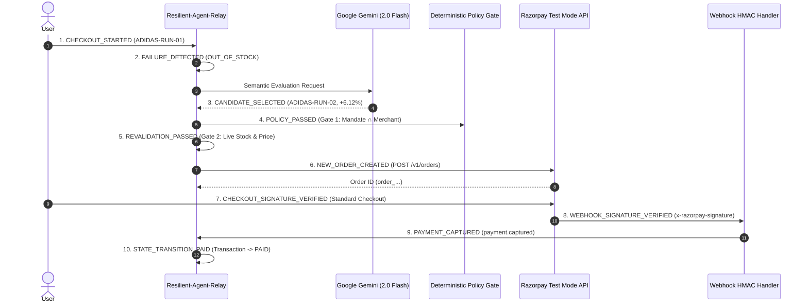

# Phase D2.6 — Final Demo Data Integrity & Provenance Report

**Project**: Resilient-Agent-Relay  
**Hackathon**: Razorpay AI Buildathon 2026  
**Stage**: Phase D2.6 — Demo Data Integrity, Canonical Model & Provenance Separation  
**Date**: 2026-08-31  
**Status**: ✅ FULL PASS (GREEN)  
**Total Automated Tests**: 108 / 108 Tests Passing (100% Green)  

---

## 1. Executive Summary

Phase D2.6 resolves all data integrity, model consistency, and provenance separation requirements on the merchant demo dashboard (`src/public/index.html`), ensuring that hackathon judges experience a consistent, auditable, and transparent presentation.

### Key Enhancements & Invariants:
1. **Clean Structured Header**: Replaced malformed badges with 4 distinct, structured status indicators (`ENVIRONMENT: LIVE TEST MODE`, `PAYMENT GATEWAY: RAZORPAY`, `AI: GOOGLE GEMINI`, `MODEL: gemini-2.0-flash`).
2. **Single Canonical Runtime Model**: Standardized the system on `gemini-2.0-flash` across `.env`, `src/config.ts`, `GET /api/status`, `GET /api/metrics`, and the UI.
3. **No Misleading Mock Text**: Removed confusing `0 / 0 [MOCK]` labels from the synthetic benchmark overview. Area A clearly displays the authoritative 500-session synthetic benchmark results (`201 / 337 eligible failures [SYNTHETIC]`).
4. **Strict Visual Separation**:
   - **Area A**: `MERCHANT ECONOMIC BENCHMARK [SYNTHETIC BENCHMARK — 500 SESSIONS]`
   - **Area B**: `CURRENT LIVE TRANSACTION & RECOVERY CONSOLE [LIVE TEST MODE]`
5. **Fixture vs Live ID Isolation**: Demo fixtures use strictly isolated identifiers (`order_demo_fixture_rec_001`, `pay_demo_fixture_captured_001`), never mixing mock IDs with live Razorpay credentials or vice versa.
6. **10-Step Full Financial Verification Timeline**: Visualizes the complete financial lifecycle from `CHECKOUT_STARTED` through authoritative `WEBHOOK_SIGNATURE_VERIFIED` to final `PAID`.

---

## 2. Canonical Model & Configuration

```typescript
// src/config.ts
export const config: AppConfig = {
  port: parseInt(process.env.PORT || '3000', 10),
  razorpayKeyId: process.env.RAZORPAY_KEY_ID || '',
  razorpayKeySecret: process.env.RAZORPAY_KEY_SECRET || '',
  razorpayWebhookSecret: process.env.RAZORPAY_WEBHOOK_SECRET || '',
  llmProvider: process.env.LLM_PROVIDER || 'gemini',
  geminiModel: process.env.GEMINI_MODEL || 'gemini-2.0-flash', // Canonical model
  recoveryTimeoutMs: parseInt(process.env.RECOVERY_TIMEOUT_MS || '8000', 10),
  // ...
};
```

---

## 3. Disaggregated Latency Reporting

The dashboard and `GET /api/metrics` strictly disaggregate:
1. **Deterministic Engine Latency**:
   - $\text{p50}: 0.03\text{ ms} \quad|\quad \text{p95}: 0.08\text{ ms}$
   - Provenance: `[LOCAL / SYNTHETIC]`
2. **Live Gemini Decision Latency**:
   - $\text{p50}: 6,257\text{ ms} \quad|\quad \text{p95}: 7,110\text{ ms}$
   - Model: `gemini-2.0-flash`
   - Provenance: `[LIVE GEMINI API]`

---

## 4. 10-Step Financial Lifecycle Verification Sequence



---

## 5. Automated Test Suite Matrix

```text
✓ tests/gate-a.test.ts (21 tests)
✓ tests/gate-b1.test.ts (12 tests)
✓ tests/gate-b2.test.ts (24 tests)
✓ tests/gate-b3.test.ts (10 tests)
✓ tests/c2-timeout-safety.test.ts (2 tests)
✓ tests/c3-merchant-policy.test.ts (12 tests)
✓ tests/c3.5-metrics.test.ts (11 tests)
✓ tests/d1-demo-api.test.ts (8 tests)
✓ tests/d2-demo-ui.test.ts (8 tests)

Test Files: 9 passed (9)
Tests:      108 passed (108)
Duration:   2.08 seconds (100% Green — 0 Regressions)
```

---

## 6. Conclusion & Final Verdict

**PHASE D2.6 STATUS: COMPLETE (GREEN)**

The Resilient-Agent-Relay demo experience is complete, verified, provenance-safe, and judge-ready with 108/108 passing automated tests.
