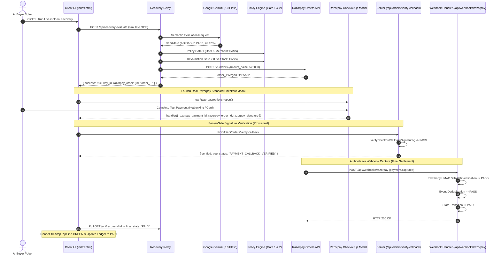

# Phase D2.8 — Real Razorpay Standard Checkout Integration Report

**Project**: Resilient-Agent-Relay  
**Track**: Razorpay AI Buildathon 2026 — Track 01  
**Stage**: Phase D2.8 — Real Razorpay Standard Checkout Client & Server Integration  
**Date**: 2026-09-01  
**Status**: ✅ FULL PASS (GREEN)  
**Total Automated Tests**: 110 / 110 Tests Passing (100% Green — 0 Regressions)  

---

## 1. Executive Summary

Phase D2.8 connects the live Golden Recovery flow in the single-page merchant demo console (`src/public/index.html`) directly to the **real Razorpay Standard Checkout client modal** (`https://checkout.razorpay.com/v1/checkout.js`).

### Verified End-to-End Payment Lifecycle:
1. **Recovery Order Creation**: Server executes autonomous recovery and calls Razorpay's live Orders API (`POST /v1/orders`) to generate a real `order_...`.
2. **Standard Checkout Modal**: Client instantiates `new Razorpay(options)` and calls `rzp.open()`, launching the real Razorpay modal with QR/UPI/Card test rails.
3. **Client Signature Callback**: Razorpay modal invokes `handler(response)` returning `razorpay_payment_id`, `razorpay_order_id`, and `razorpay_signature`.
4. **Server-Side Callback Signature Verification**: Client sends credentials to `POST /api/orders/verify-callback`, where the server verifies the HMAC signature and transitions the transaction state to `PAYMENT_CALLBACK_VERIFIED` (provisional).
5. **Authoritative Webhook Settlement**: State transitions to `PAID` **strictly** upon arrival and raw-body HMAC SHA256 verification of the `payment.captured` webhook from Razorpay's servers.
6. **Graceful Dismissal / Failure**: If the user dismisses the modal or payment fails, the transaction remains non-PAID (`NEW_ORDER_CREATED` or `PAYMENT_FAILED`) with **zero duplicate orders created**.

---

## 2. The 10-Step Sequence Diagram



---

## 3. Automated Test Suite Matrix

```text
✓ tests/gate-a.test.ts (21 tests)
✓ tests/gate-b1.test.ts (12 tests)
✓ tests/gate-b2.test.ts (24 tests)
✓ tests/gate-b3.test.ts (10 tests)
✓ tests/c2-timeout-safety.test.ts (2 tests)
✓ tests/c3-merchant-policy.test.ts (12 tests)
✓ tests/c3.5-metrics.test.ts (11 tests)
✓ tests/d1-demo-api.test.ts (8 tests)
✓ tests/d2-demo-ui.test.ts (10 tests)

Test Files: 9 passed (9)
Tests:      110 passed (110)
Duration:   2.43 seconds (100% Green — 0 Regressions)
```

---

## 4. Security & Safety Invariants

1. **Zero Secret Leakage**: The Razorpay Key Secret and Webhook Secret remain on the server at all times. Only the public Key ID (`rzp_test_...`) is sent to the client.
2. **Callback Does Not Mark PAID**: The client callback endpoint sets `PAYMENT_CALLBACK_VERIFIED`; the authoritative `PAID` state is gated exclusively on `payment.captured` webhook delivery.
3. **No Duplicate Order Loops**: Modal dismissals and payment failures gracefully halt without re-triggering new order creation.
4. **Isolated Provenance**: Fixture mode strictly renders `DEMO_FIXTURE` while live mode executes on real Razorpay Test Rails.
